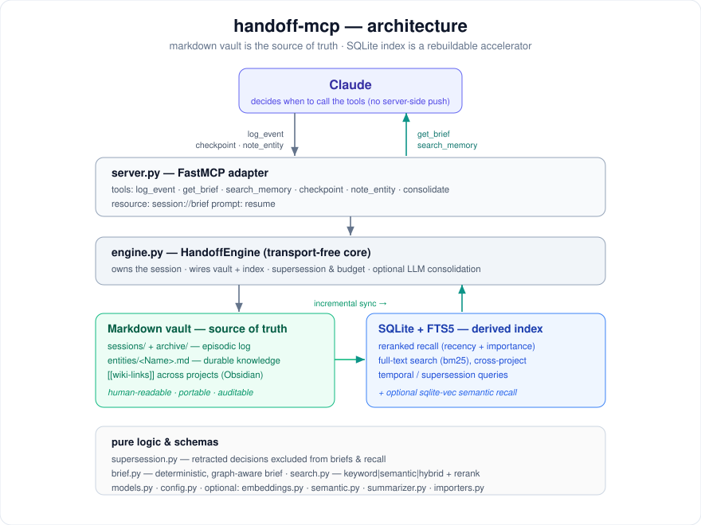

# handoff-mcp

<!-- mcp-name: io.github.kirill-sviridov/handoff-mcp -->

[](https://github.com/kirill-sviridov/handoff-mcp/actions/workflows/ci.yml)
[](https://www.python.org/)
[](https://mypy-lang.org/)
[](https://github.com/astral-sh/ruff)
[](LICENSE)

> **Your agent's memory between sessions.** Persistent, cross-project hand-off for
> Claude over the Model Context Protocol — it remembers the goal, the decisions,
> the dead-ends, and what's next, so the next session never starts from zero.

Claude forgets everything between sessions. `handoff-mcp` gives it a memory that
survives the context window: it tracks the *progress* of your work — goals,
decisions and their rationale, dead-ends, open questions, the next step — and at
the boundary of a session produces a **prioritised, token-budgeted brief** so the
next session resumes already knowing where you left off.

It is not a context dump. Two things make it different from similarity-based
memory stores (mem0 / OpenMemory style):

1. **Temporal supersession.** A new decision retracts an old one; retracted
   decisions never appear in a future brief. Memory reflects the *current* state
   of the world, not a flat pile of contradictory facts.
2. **Deterministic brief.** The brief is assembled by an explainable ranker
   (recency + importance + supersession), not by an LLM — so it is reproducible
   and stays within a token budget (a soft cap on event content; see
   [Limitations](#limitations)).
3. **Your store, multi-device.** The vault is your own private git repo, not a
   hosted service — so memory can follow you across machines (pull-on-start,
   push-on-checkpoint, conflict-free entity merges) with zero vendor lock. See
   [Multi-device sync](#multi-device-sync-optional).

> **Status: v0.2, early.** The core (vault, brief, supersession, keyword search,
> cross-project recall) is tested and stable; the semantic, consolidation,
> importer, and multi-device sync layers are optional and newer. It leans on the agent calling the tools
> at the right moments — see [Limitations](#limitations) for the honest edges.

It is also **cross-project**: one vault, namespaced per project. The brief is
project-scoped (where did I leave off *here*), but `search_memory` recalls across
*all* projects — so when you say *"in one of my projects we did X"*, Claude can
find and pull that decision out of another project.

## Contents

- [Demo: two sessions](#demo-two-sessions)
- [Benchmarks](#benchmarks)
- [How it works](#how-it-works)
- [MCP tools](#mcp-tools)
- [Cost & API keys](#cost--api-keys)
- [Semantic recall (optional)](#semantic-recall-optional)
- [Memory consolidation (optional)](#memory-consolidation-optional)
- [Import existing history](#import-existing-history)
- [Quickstart](#quickstart)
- [Connect your MCP client](#connect-your-mcp-client) — Claude, Cursor, Codex, Kilo Code, …
- [Where your memory lives](#where-your-memory-lives)
- [Multi-device sync (optional)](#multi-device-sync-optional)
- [Agent integration](#agent-integration)
- [Limitations](#limitations)
- [Development](#development)
- [License](#license)

## Demo: two sessions

`python examples/two_sessions_demo.py` — session 1 works and stops; session 2 is
a *fresh* process that resumes from the brief alone.

**Session 1** logs its progress (and changes its mind once):

```python
log_event("goal",     "Ship the finance agent: income/expense tracking…")
d = log_event("decision", "Store transactions in a flat JSON file.")
log_event("decision", "Use SQLite instead of JSON — need queries.", supersedes=[d])  # retracts ↑
note_entity("Architecture", "SQLite-backed; LLM summary calls run in a worker.")     # durable
log_event("deadend",  "Provider streaming API times out on long months; needs chunking.")
log_event("question", "Recurring transactions: templates or materialised rows?")
log_event("next_step","Write the SQLite schema, then the ingest function.")
checkpoint("Chose SQLite; finance schema is next.")
```

**Session 2** calls `get_brief()` and gets back only the *current* state — the
retracted JSON decision is gone:

```markdown
# Hand-off brief — agent-hub

## Goal
- Ship the finance agent: income/expense tracking with scheduled summaries.
## Next step
- Write the SQLite schema for transactions and categories, then the ingest function.
## Decisions
- Use SQLite for transactions instead of JSON — need queries for summaries. See [[Architecture]].
## Dead ends (tried & failed)
- Tried the provider's streaming API for the summary job — times out on long months. Don't retry without chunking.
## Open questions
- Should recurring transactions be modelled as templates or materialised rows?
## Related knowledge
- [[Architecture]] — SQLite-backed; LLM summary calls run in a worker.
```

> The retracted "flat JSON file" decision never appears. The graph-linked
> `[[Architecture]]` note is pulled in automatically. The brief is ~170 tokens.

And cross-project recall — `search_memory("timeout chunking", scope="all")` pulls
a decision out of a *different* project:

```
- [hermes]    In the Hermes project we solved long-job timeouts by chunking requests.
- [agent-hub] Tried the provider's streaming API for the summary job — times out on long months…
```

## Benchmarks

Two offline, deterministic benchmarks — no LLM, no network — so they regenerate
identically anywhere and are pinned by `tests/test_benchmark.py`. Full numbers,
methodology, and how to reproduce: [`benchmarks/RESULTS.md`](benchmarks/RESULTS.md).

**1. Supersession in isolation** (`benchmarks/supersession_benchmark.py`). A
project's decisions evolve across 8 statements over 4 topics; each has one decision
a later one retracts (JSON→SQLite, cookies→JWT, …). Retrieved **by decision** (so
every stale fact is reachable), the flat log vs the active view:

| mode | stale leaked | current kept |
|------|:------------:|:------------:|
| supersession OFF (flat log) | 4 / 4 | 4 / 4 |
| supersession ON (active view) | **0 / 4** | **4 / 4** |

Supersession removes exactly the retracted decisions while keeping every current
one — and scoring *current kept* too means an empty answer can't pass as a win. A
similarity store with no notion of one fact retiring another behaves like the OFF
row.

**2. Brief vs naive dump** (`benchmarks/brief_reconstruction.py`). What a resuming
session actually reads — the budgeted, supersession-aware brief vs pasting back the
whole log. As history grows the dump balloons and keeps carrying every retraction;
the brief stays bounded (a soft cap) and contradiction-free while retaining all
key items (e.g. at 228 events: 3063→217 tokens, 14×, 3 contradictions → **0**).

> These measure the mechanism honestly rather than staging a head-to-head against
> another store — a fair cross-system run needs both under identical retrieval plus
> an LLM endpoint we can't reproduce in CI (see
> [ADR-0008](docs/adr/0008-honest-benchmark.md)).
>
> "Tokens" here and elsewhere in this README are estimated as `len(text) / 4`
> (model-agnostic), not counted with a real tokenizer.

## How it works

<p align="center">
  
</p>

The markdown vault is the source of truth — human-readable, openable in
Obsidian, your data on your disk. The SQLite + FTS5 index is *derived* from the
vault and can be rebuilt at any time; it powers ranking, the token budget, and
cross-project full-text search.

See [`docs/architecture.md`](docs/architecture.md) and the
[ADRs](docs/adr/) for the design rationale.

## MCP tools

| Tool | When Claude calls it |
|------|----------------------|
| `get_brief(project?, token_budget?)` | At session start — load where the last session left off. |
| `log_event(type, content, importance?, supersedes?, supersedes_query?, project?)` | As work happens — record goals, decisions, dead-ends, files, questions, next steps. `supersedes` retires a prior event by id; `supersedes_query` retires the best-matching active event of the same type when you don't have its id ([ADR-0007](docs/adr/0007-supersede-by-best-match.md)). |
| `search_memory(query, scope=current\|all, limit?)` | When the user references past or other-project work. `limit` caps the number of results (default 10). Each hit includes the event id, feedable straight into `log_event`'s `supersedes`. |
| `note_entity(name, content, project?)` | To record durable project knowledge (architecture, conventions, components). |
| `checkpoint(summary?, project?)` | At session end — finalise the session and emit the brief. Pass the same `project` you logged under (defaults to the session's project). |
| `consolidate(project?, older_than_days?)` | To compress old sessions into durable notes (opt-in, needs an LLM). |
| `sync(remote_url?)` | To sync memory across devices — pull, commit, and push the vault's private git remote (opt-in). First call with a repo URL configures it; then a bare call syncs. See [Multi-device sync](#multi-device-sync-optional). |

Also exposed: an MCP resource `session://brief` and a prompt `resume` for
auto-loading the brief at the top of a session.

`log_event` types: `goal`, `decision`, `deadend`, `file`, `question`, `next_step`.

## Cost & API keys

**No subscription. No required API keys. The core is free and fully local** —
your memory is plain files on your disk, and handoff-mcp never phones home (no
hosted service, no telemetry).

| Capability | Needs a model / key? |
|------------|----------------------|
| Memory, brief, supersession, keyword search, cross-project, importers | **No** — local, offline, free |
| Semantic recall *(optional)* | No by default (`hashing` or local `sentence-transformers`); bring your own OpenAI-compatible key only if you pick the `openai` backend |
| Consolidation *(optional, occasional)* | A model — your own key (a few cents, run rarely; it's not a hot path) **or** a local model |

So most of the value costs nothing and needs no key. The optional layers either
run locally or use *your own* provider — you're never locked into ours.

## Semantic recall (optional)

Keyword search (FTS5/bm25) is the default and needs nothing extra. You can enable
a semantic layer that fuses keyword and embedding similarity with Reciprocal Rank
Fusion:

```bash
HANDOFF_SEMANTIC=1 handoff-mcp     # turn the layer on (default: hashing backend)
```

**The backend you pick decides whether this actually understands paraphrases.**
The default `hashing` backend is a *lexical* baseline — it hashes tokens, so it
adds fuzzy lexical matching (and demonstrates the hybrid pipeline) but does **not**
recall on meaning when the words differ. For genuine paraphrase-tolerant recall,
choose `local` or `openai`, which use learned embeddings.

**Pluggable embedding backends**, selected with `HANDOFF_EMBEDDER` — one server,
no forks:

| Backend | Install | Paraphrase? | Notes |
|---------|---------|:-----------:|-------|
| `hashing` (default) | — | No — lexical | Deterministic, offline, zero-dependency toy baseline (feature-hashing). Good for demos/tests; not real semantics. |
| `local` (recommended) | `pip install -e ".[semantic-local]"` | Yes | Offline `sentence-transformers`; no key, pulls in torch. Default model `Qwen/Qwen3-Embedding-0.6B` (multilingual incl. Russian, 1024-dim, Apache-2.0). |
| `openai` | `pip install -e ".[semantic-openai]"` | Yes | Any OpenAI-compatible endpoint (OpenAI, Together, a self-hosted proxy, …). Set `HANDOFF_EMBED_BASE_URL` / `OPENAI_BASE_URL` and `HANDOFF_EMBED_API_KEY` / `OPENAI_API_KEY`. |

```bash
# Example: semantic recall via any OpenAI-compatible endpoint
pip install -e ".[semantic-openai,semantic]"
export HANDOFF_SEMANTIC=1 HANDOFF_EMBEDDER=openai
export HANDOFF_EMBED_BASE_URL=https://your-openai-compatible-endpoint/v1 HANDOFF_EMBED_API_KEY=sk-…
export HANDOFF_EMBED_MODEL=text-embedding-3-small
```

Design (see [ADR-0004](docs/adr/0004-optional-semantic-layer.md)):

- **Pluggable embedder behind an `Embedder` protocol** — the `hashing` default is
  deterministic and dependency-free; `openai` / `local` plug in for real semantic
  quality without changing anything else.
- **sqlite-vec is an accelerator, not a requirement** (`.[semantic]`) — vectors
  persist as BLOBs and search works with an exact cosine scan; if `sqlite-vec` is
  installed and loadable, a `vec0` table provides fast KNN with the same top-ranked results.
- The deterministic brief never consults embeddings — semantics only affect
  `search_memory`.
- **Reranking** — recall results (any mode) are reordered by a deterministic
  blend of relevance + recency (time-decay) + importance, so fresh, high-priority
  memories surface first. No LLM; pass `rerank=False` to get raw relevance order.
- **Incremental embedding** — events are immutable, so startup only embeds *new*
  events (cached vectors are reused); the cache self-invalidates if the embedding
  model's dimension changes. This keeps heavier local models practical.

To use a lighter/faster local model instead, set `HANDOFF_EMBED_MODEL` (e.g.
`Alibaba-NLP/gte-multilingual-base`, 305M/768-dim — also set
`HANDOFF_EMBED_TRUST_REMOTE_CODE=1` as that model requires it).

## Memory consolidation (optional)

Over a long-lived project the episodic log grows without bound — a *volume*
problem, not just an indexing one. Consolidation ("sleep") folds it down:

```bash
HANDOFF_LLM_MODEL=gpt-4o-mini handoff-mcp   # enables the consolidate tool
```

`consolidate(project?, older_than_days?)` distils old finished sessions' **active**
decisions into the durable entity notes (Architecture, Decisions, Dead-ends, …),
then **archives** the originals to `<project>/archive/` and drops them from the
active index. So the vault shrinks but the lasting knowledge — which the brief
already surfaces — is kept.

- It is the **only** step that calls an LLM, and it's **off** unless
  `HANDOFF_LLM_MODEL` is set (OpenAI-compatible; reuses the embedder's endpoint
  settings). The brief, search, and supersession stay deterministic.
- Only **active** events are distilled — a retracted decision is never
  immortalised. Dead-ends are kept as cautionary facts.
- Originals are **archived, not deleted** (auditable, reversible).

See [ADR-0006](docs/adr/0006-memory-consolidation.md).

## Import existing history

Bootstrap a project's memory from data you already have, so it's useful from
minute one instead of empty:

```bash
handoff-import git ./my-repo --project my-project        # commit history → memory
handoff-import claude session.jsonl --project my-project # a Claude Code transcript
```

- **git** turns each commit into a decision (the subject) plus a files-touched
  note, timestamped at the commit date — fully deterministic, no LLM.
- **claude** pulls the first prompt as a goal and file edits as file events from a
  Claude Code transcript (best-effort).
- Import is **idempotent** (ids derive from the source), so re-running only adds
  what's new. Writes into the same shared vault (`HANDOFF_VAULT`).

## Quickstart

```bash
uv venv && uv pip install -e ".[dev]"

# Run the two-session demo: session 1 works, session 2 reads the brief.
python examples/two_sessions_demo.py
```

## Connect your MCP client

`handoff-mcp` speaks standard MCP over stdio, so it works with **any** MCP client —
Claude, Cursor, Codex, Kilo Code, Windsurf, Cline, VS Code, Zed, … The config is
essentially the same everywhere; only the file location (and, for Codex, the
format) differs.

**Canonical config** — the `mcpServers` JSON block used by Claude, Cursor, Kilo
Code, Windsurf, Cline, and most others:

```json
{
  "mcpServers": {
    "handoff": {
      "command": "handoff-mcp",
      "env": {
        "HANDOFF_VAULT": "/path/to/your/vault",
        "HANDOFF_PROJECT": "my-project"
      }
    }
  }
}
```

| Client | Where it goes |
|--------|---------------|
| **Claude Code** | `claude mcp add handoff -- handoff-mcp`, or a `.mcp.json` in the project |
| **Claude Desktop** | `claude_desktop_config.json` |
| **Cursor** | `.cursor/mcp.json` (project) or `~/.cursor/mcp.json` (global) |
| **Kilo Code** | Settings → MCP → Add Server → *Local (stdio)*, or `.kilocode/mcp.json` |
| **Windsurf** | `~/.codeium/windsurf/mcp_config.json` |
| **Cline / Roo Code** | the extension's MCP panel → `cline_mcp_settings.json` |
| **VS Code** (Copilot) | `.vscode/mcp.json` — note the different schema below |

**Codex CLI** uses TOML in `~/.codex/config.toml` (or run `codex mcp add`):

```toml
[mcp_servers.handoff]
command = "handoff-mcp"
[mcp_servers.handoff.env]
HANDOFF_VAULT = "/path/to/your/vault"
HANDOFF_PROJECT = "my-project"
```

**VS Code** uses `"servers"` and an explicit type:

```json
{ "servers": { "handoff": { "type": "stdio", "command": "handoff-mcp",
  "env": { "HANDOFF_VAULT": "/path/to/your/vault", "HANDOFF_PROJECT": "my-project" } } } }
```

Notes:
- `handoff-mcp` must be on `PATH` — install it as a tool
  (`uv tool install git+https://github.com/kirill-sviridov/handoff-mcp`; PyPI release coming)
  or, from a checkout, use `"command": "python", "args": ["-m", "handoff_mcp.server"]`.
- Set `HANDOFF_PROJECT` per agent/repo; keep `HANDOFF_VAULT` pointed at the **same
  shared vault** across all of them (see below).

## Where your memory lives

One **central vault**, with a folder per project inside it:

```
~/.handoff-mcp/vault/            # HANDOFF_VAULT (default; override per machine)
├── .index.db                    # derived SQLite index — rebuildable, gitignore it
├── my-project/
│   ├── sessions/<id>.md         # episodic notes
│   └── entities/<Name>.md       # durable knowledge
└── another-project/…
```

- **One vault, not one-per-repo.** Cross-project recall (`search_memory`) only
  works because every project lives in a single store. So point every agent's
  `HANDOFF_VAULT` at the same directory and just vary `HANDOFF_PROJECT`.
- **It lives outside your code repos**, so it never gets committed into your work
  projects by accident — your project repos stay clean.
- **Want backup / multi-machine sync?** The vault is plain markdown, so version it
  on its own (a private git repo, Obsidian Sync, Dropbox…). For built-in git sync
  across devices — pull-on-start, push-on-checkpoint, conflict-free entity merges —
  see [Multi-device sync](#multi-device-sync-optional); `handoff-sync --setup`
  configures the remote and gitignores the derived index for you.
- **Prefer memory that travels with one repo?** Point `HANDOFF_VAULT` inside that
  repo (e.g. `./.handoff`) — but then search sees only that project. The shared
  vault is recommended.

## Multi-device sync (optional)

Your vault is just a private git repo, so memory can follow you across machines.
Sync is strictly opt-in — with no git configured, memory works fully on one
device.

| Tier | Setup | You get |
| --- | --- | --- |
| **Local-only** (default) | nothing | full memory, one device, no account |
| **Manual** | `handoff-sync --setup <private-repo-url>` once | `handoff-sync` (or the `sync` tool) pulls, commits, pushes on demand |
| **Automatic** | above + `HANDOFF_AUTO_SYNC=1` | pull at session start, push at checkpoint |

Entity notes merge cleanly across machines via git's built-in `union` driver
(`*/entities/*.md merge=union` in the vault's `.gitattributes`, written by setup).
In a shell-less client (e.g. Cursor), just ask the agent to sync — the `sync`
tool needs no terminal. Setup needs working git auth (`gh auth login` or an SSH
key); if a push fails, the command tells you exactly what to fix.

## Agent integration

*Knowing **when** to use it.* The server never pushes anything to the model; the
model decides when to call the tools. Three layers make that reliable, from most portable to most capable:

1. **Tool descriptions** (built in) — every tool says *when* to call it. Works in
   any MCP client.
2. **Server `instructions`** (built in) — a short ritual the server sends on
   connect (load the brief at start, log as you work, checkpoint at the end).
   Portable across Claude Desktop, Cursor, and other MCP clients.
3. **Claude Code skills** ([`skills/`](skills/)) — encode the *workflow* and,
   crucially, trigger on colloquial cues:
   - [`session-handoff`](skills/handoff/SKILL.md) — when you say "го в следующую
     сессию" / "that's it for today", the agent knows to `checkpoint` on its own.
     It also bootstraps the project's instruction file on first use (`CLAUDE.md`,
     or `AGENTS.md` / `.cursor/rules/handoff.mdc` / `.windsurfrules` per client).
   - [`session-planning`](skills/planning/SKILL.md) — optional companion: breaks a
     big task into session-sized chunks and persists the plan in memory.

   Install by copying into your skills dir:

   ```bash
   cp -r skills/handoff skills/planning ~/.claude/skills/   # user-wide
   # or .claude/skills/ inside a specific project
   ```

   (Skills are a Claude Code / claude.ai feature; other agents rely on layers 1–2.)

   For non-Claude clients, drop the memory block into the project's instruction
   file with the `handoff-init` CLI (idempotent):

   ```bash
   handoff-init                 # CLAUDE.md
   handoff-init --client codex  # AGENTS.md   ·   --client cursor / windsurf
   ```

For Claude Code specifically, also add this to your `CLAUDE.md` so the brief loads
automatically even without the skill:

> At the start of a session call `get_brief`. Record decisions, dead-ends and the
> next step with `log_event` as you work — one atomic item per call (1-2 sentences
> with the why), not a whole-session summary; reference durable notes as
> `[[Entity]]`. `checkpoint` before you stop. When I mention past work or another
> project, call `search_memory`.

## Limitations

Honest edges of v0.2, so you know what you're adopting:

- **Supersession is explicit, not inferred.** handoff-mcp never decides on its own
  that one memory retires another — the agent must say so, via `supersedes` (by id)
  or `supersedes_query` (by best match). That is deliberate (it's what keeps the
  brief deterministic and auditable), but it means the quality of the memory
  depends on the agent actually logging retractions. It won't silently
  de-duplicate contradictions the way an LLM-extraction store attempts to.
- **It depends on the agent's discipline.** The server never pushes anything; value
  comes from the model calling `log_event` / `get_brief` / `checkpoint` at the
  right moments. The tool descriptions and the skill nudge this, but a client that
  never calls the tools gets an empty vault. Cross-session memory is only as good
  as what got logged.
- **The default semantic backend (`hashing`) is lexical, not paraphrase-aware.**
  Real paraphrase recall needs `local` or `openai` (see
  [Semantic recall](#semantic-recall-optional)). The deterministic brief itself
  never uses embeddings.
- **The token budget is soft.** It bounds event *content*; section headings and the
  "Related knowledge" block are chrome on top, so the rendered brief can sit a
  little above the number. It keeps the brief bounded and flat as history grows —
  it is not a hard byte cap.
- **Single-process freshness.** One vault can be shared across processes/agents
  (SQLite WAL + a busy timeout let writers coexist), but a running process refreshes
  its view of the vault at **startup** (`_sync_index`) — it picks up its own writes
  live, but another process's new events only on the next launch (a `sync` — manual
  or the `HANDOFF_AUTO_SYNC` pull-on-brief — re-indexes mid-session when it pulls
  new events). For concurrent *threads* inside one process, access to the shared
  index is serialised by a lock.
- **Personal/team scale.** Ranking loads a project's events into memory; this is
  fine for thousands of sessions, not tuned for millions (see
  [ADR-0005](docs/adr/0005-incremental-index-sync.md) for the localized fixes if
  that day comes).

## Development

```bash
uv pip install -e ".[dev]"
ruff check . && mypy && pytest
python examples/two_sessions_demo.py        # the hand-off in action
python examples/demo_presentation.py         # paced/narrated version (for recording a GIF)
python examples/stdio_smoke.py              # run it as a real stdio MCP server
python benchmarks/brief_reconstruction.py   # brief vs naive full-dump
python benchmarks/supersession_benchmark.py # supersession on vs off, in isolation
```

## License

MIT — see [LICENSE](LICENSE).
