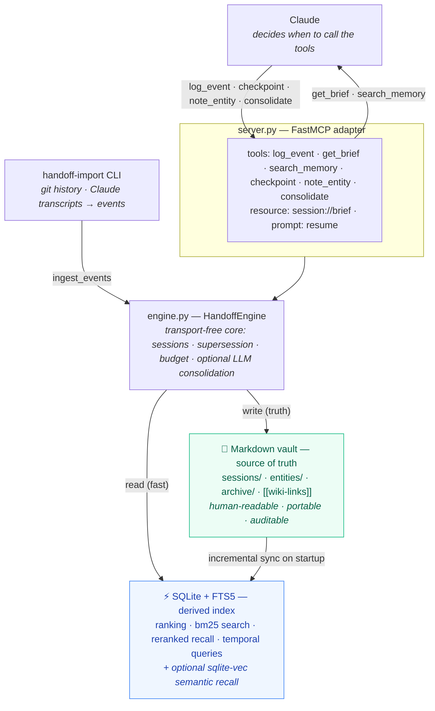

# Architecture

handoff-mcp is a small system with a deliberately strict separation between the
**source of truth** (a markdown vault) and a **derived accelerator** (a SQLite +
FTS5 index). Everything user-facing flows through the MCP server.



## Layers

```
 ┌─────────────────────────────────────────────────────────────┐
 │ server.py        FastMCP adapter                              │
 │   6 MCP tools · resource session://brief · prompt resume      │
 ├─────────────────────────────────────────────────────────────┤
 │ engine.py        HandoffEngine — transport-free application   │
 │   core. Wires vault + index; owns the current session.        │
 │   (handoff-import CLI feeds it via ingest_events)             │
 ├──────────────────────────────┬──────────────────────────────┤
 │ vault.py                      │ index.py                       │
 │   markdown notes (truth)      │   SQLite + FTS5 (derived)       │
 │   sessions/ entities/ archive/│   ranking · search · temporal   │
 ├──────────────────────────────┴──────────────────────────────┤
 │ brief.py · supersession.py · search.py (rerank)  (pure logic) │
 │ embeddings.py · semantic.py · summarizer.py · importers.py    │
 │   (optional: embeddings + LLM consolidation backends)         │
 │ models.py (Pydantic schemas)  · config.py (paths/budget)      │
 └─────────────────────────────────────────────────────────────┘
```

## Data flow

**Write path — `log_event`:**
1. The engine builds a validated `Event` (Pydantic).
2. It is appended to the session's markdown note (the durable write).
3. It is upserted into the SQLite index (the fast read path).

The vault write is authoritative. The index persists across runs and is synced
**incrementally** on startup — only session notes whose `(mtime, size)` changed
are re-parsed — so startup scales with *new* work, not total history. A lost or
deleted index self-heals (every note looks new). See
[ADR-0005](adr/0005-incremental-index-sync.md).

**Read path — `get_brief`:**
1. The engine pulls the project's events from the index.
2. `supersession.active_events` drops everything that a later event retracted.
3. `brief.build_brief` ranks the survivors (section priority → importance →
   recency) and packs them into the token budget in priority order; lower-priority
   items are dropped when space runs out. It is also graph-aware (see below).

**Recall path — `search_memory`:**
FTS5 `MATCH` with bm25 ranking, optionally restricted to the current project.
Superseded hits are filtered out by default so recall reflects current state.
Results are then **reranked** by a deterministic blend of relevance + recency
(time-decay) + importance, so fresh, high-priority memories surface first.
With the optional semantic layer enabled (`HANDOFF_SEMANTIC=1`), keyword and
embedding-similarity results are fused with Reciprocal Rank Fusion; see
[ADR-0004](adr/0004-optional-semantic-layer.md).

## Two memory layers

* **Episodic** — one markdown note per session (`sessions/<id>.md`). An honest,
  append-only log of what happened.
* **Durable** — project-knowledge entity notes (`entities/<Name>.md`):
  Architecture, Conventions, Component X, Open Questions. Linked from session
  notes with Obsidian-style `[[wiki-links]]`, including cross-project links.

The brief is built from the episodic layer (with supersession applied) and is
**graph-aware**: it appends a "Related knowledge" section listing the durable
entities the kept events link to (ranked by link frequency), each with a
one-line summary pulled from its note — so a resuming session sees the relevant
project knowledge, not just the recent log.

## Optional layers (the LLM boundary)

The core — vault, index, brief, supersession, search — is deterministic and
LLM-free. Three optional layers sit *around* it, each off by default:

* **Semantic recall** (`HANDOFF_SEMANTIC=1`) — a pluggable embedder (hashing /
  OpenAI-compatible / local) + a vector store; fused with keyword via RRF. Affects
  only `search_memory`, never the brief ([ADR-0004](adr/0004-optional-semantic-layer.md)).
* **Consolidation** (`HANDOFF_LLM_MODEL`, the `consolidate` tool) — the *only*
  LLM write-path: distils old sessions' active events into entity notes and
  archives the originals ([ADR-0006](adr/0006-memory-consolidation.md)).
* **Importers** (`handoff-import`) — deterministically (git) or best-effort
  (Claude transcripts) seed memory from existing history via `ingest_events`.

Removing any of these leaves a fully working deterministic system.

## Why this shape

* **Markdown as truth** → the user owns readable data, openable in Obsidian; the
  system is auditable and not locked to our index format. See
  [ADR-0003](adr/0003-markdown-as-source-of-truth.md).
* **SQLite over a vector DB** → zero-infra, embedded, exact temporal/recency
  queries; semantic recall is an optional add-on, not the core. See
  [ADR-0001](adr/0001-sqlite-not-vectordb.md).
* **Deterministic brief** → reproducible, budget-bounded, benchmarkable; no LLM
  in the hot path of reconstructing context. See
  [ADR-0002](adr/0002-deterministic-brief.md).
